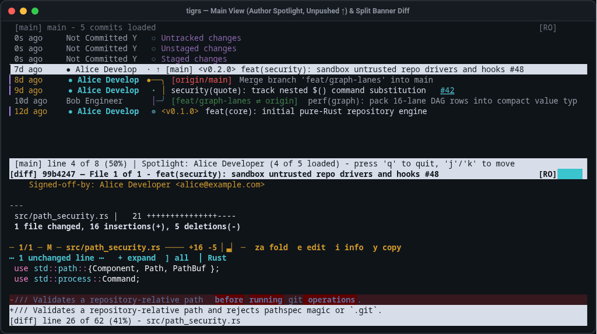
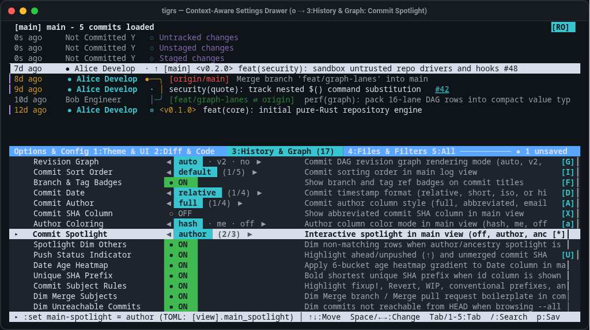
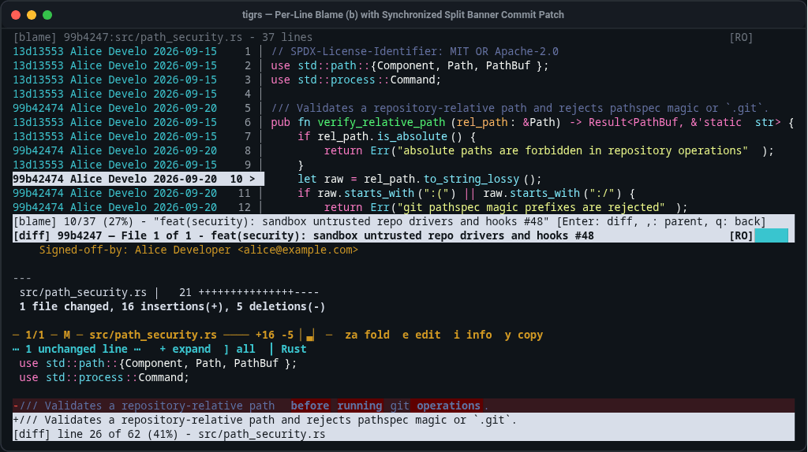

<div align="center">

# tigrs

**Browse history, review diffs side-by-side, and stage changes—right in your terminal.**

A blazing-fast, security-hardened Git TUI inspired by [**tig**](https://jonas.github.io/tig/), built in 100% safe Rust for effortless code review, surgical staging, and instant startup on repositories of any size.

[](#more-resources)
[](#install)
[![Memory Safety: #![forbid(unsafe_code)]](https://img.shields.io/badge/Rust-100%25%20Safe%20(%23!%5Bforbid(unsafe__code)%5D)-brightgreen.svg)](#built-for-untrusted-code)
[](#built-for-untrusted-code)

[**Highlights**](#highlights) · [**Security**](#built-for-untrusted-code) · [**Visual Tour**](#see-it-in-action) · [**Benchmarks**](#how-fast-is-it) · [**Workflows**](#everyday-workflows) · [**Install**](#install) · [**Cheat Sheet**](#60-second-cheat-sheet)

</div>

<p align="center">
  
  <br />
  <em>Side-by-side diff review (<code>v</code>), sticky file &amp; function banners, inline word-diff highlights, and live theme switching (<code>o</code> &rarr; <code>t</code>).</em>
</p>

---

## Highlights

* **Instant on Any Repository**: Opens a 1.3-million-commit monorepo (like the Linux kernel) in **~45 milliseconds**—rendering the first screen immediately while streaming the remaining history in the background with live `%` progress.
* **Spot History Patterns at a Glance**: Automatically color-codes authors (**`a`**), marks your own commits (**`●`**) and unpushed local commits (**`↑`**), merges synced branch badges (**`[main ⇄ origin]`**), and lets you press **`*`** on any commit to **spotlight every commit by that author or along that branch's ancestry**.
* **Side-by-Side & Unified Code Review in the Terminal**: Press **`v`** to switch between **Unified** and **Side-by-Side** diffs with sticky file banners and intraline word-change highlights. Press **`+`** to reveal more surrounding code on the fly, **`za`** to fold reviewed or generated files, **`M`** to highlight moved code blocks, **`i`** to inspect file metadata, or **`y`** to copy raw Git headers.
* **Commit Only What You Intend**: Stage an entire file (**`u`**), a single hunk (**`u`**), or **one individual line** (**`1`**) so stray debug edits never sneak into your commits. Spot an issue while reviewing? Press **`e`** to jump straight to that exact file and line in your `$EDITOR`.
* **Live Settings & Theme Drawer (`o`)**: Press **`o`** from any screen to open the interactive Settings Menu. Preview **14 built-in color themes** (*Tokyo Night*, *Dracula*, *Catppuccin*, *GitHub Dark/Light*, *Solarized*, *Gruvbox*, *Nord*, and more), filter 44 options live with **`/`**, and press **`p`** to save your setup to `~/.config/tigrs/config.toml`.
* **Safe by Default on Cloned Code**: Automatically neutralizes repository-local hooks, custom diff/filter drivers, and malicious terminal escape sequences so inspecting an unfamiliar repo never executes untrusted code.

---

## Built for Untrusted Code

Developers constantly `git clone` unfamiliar open-source projects, pull-request branches, bug reproductions, and security PoCs. In many Git setups, simply inspecting status or diffs inside a freshly cloned repository can trigger shell commands hidden in `.git/config` or `.gitattributes`, or inject deceptive control sequences into your terminal emulator.

`tigrs` treats **every repository as untrusted by default**, protecting your machine across four layers without slowing down your workflow:

| Security Layer | What `tigrs` Protects Against | How It Works |
| :--- | :--- | :--- |
| **Zero-Click Hook & Driver Sandboxing** | Arbitrary command execution hidden in a cloned repo's `.git/config` or `.gitattributes` | Neutralizes `core.fsmonitor`, `core.hooksPath`, `core.pager`, `core.editor`, `diff.*.textconv`, `diff.*.command`, and `filter.*.clean/smudge` before any Git operation runs |
| **Terminal Escape & Trojan Source Defense** | Clipboard hijacking (`OSC-52`), terminal title spoofing, and invisible Unicode `BiDi` source attacks | Sanitizes raw control characters and bidirectional override sequences across commit messages, author names, ref names, diff lines, and file paths |
| **One-Key Read-Only Lock (`[RO]`)** | Accidental staging, file discards, or edits while auditing sensitive or production code | Launch with `tigrs --read-only` (`--ro`) or run `:ro` at any time to block all repository mutations and display a persistent **`[RO]`** badge in the title bar |
| **100% Memory-Safe Rust** | Buffer overflows and memory corruption from malformed packfiles, trees, or patches | Enforces `#![forbid(unsafe_code)]` across every crate in the workspace with zero non-system C library dependencies |

---

## See It in Action

### 1. Live Settings Drawer (`o`), Theme Picker (`t`) & Read-Only Lock (`[RO]`)

Press **`o`** from any screen to adjust settings with **`←` / `→` / `Space`**, search options with **`/`**, and watch the interface update immediately behind the drawer. Press **`p`** to persist your changes to disk, or lock the repository into **Read-Only Mode (`[RO]`)** when auditing code:



### 2. Blame Time-Travel (`b`), File Tree (`t`) & Split Patch Preview (`Enter`)

Press **`b`** on any file to see who wrote each line and why. Press **`Enter`** to inspect the commit's full patch in a split pane, or press **`,`** to step backward in time to the parent commit *before* that line was changed:



---

## How Fast Is It?

### 1. Large Monorepo Performance (Linux Kernel — 1,338,641 Commits)

The following benchmarks measure Time to First Frame (TTFF) when opening a 1.34-million-commit repository:

| Aspect | `tigrs` | `tig` | `lazygit` | `gitui` | Speedup & Behavior |
| :--- | ---: | ---: | ---: | ---: | :--- |
| **Open Commit History (`tigrs`)** | **45 ms** | 1,858 ms | ~600–1,500 ms | ~300–900 ms | **41× faster than `tig`**; renders first frame immediately and streams history in the background |
| **Open File Blame (`tigrs blame Makefile`)** | **84 ms** | 1,880 ms | — | — | **22× faster than `tig`**; displays the file viewport immediately while blame history loads |
| **Open Working Tree Status (`tigrs status`)** | **389 ms** | 536 ms | ~450–900 ms | ~350–600 ms | **1.4× faster than `tig`**; scans working tree status off the UI thread |

### 2. Everyday Repository Speed & Interactive Latency

The following metrics compare startup latency on a standard repository alongside interactive navigation and diff rendering:

| Aspect | `tigrs` | `tig` | Performance Impact |
| :--- | ---: | ---: | :--- |
| **Open Commit History (Standard Repo)** | **19 ms** | 35 ms | **1.9× faster** startup to first interactive frame |
| **Open Working Tree Status (Standard Repo)** | **30 ms** | 55 ms | **1.8× faster** status view initialization |
| **Open File Blame (Standard Repo)** | **20 ms** | 59 ms | **2.9× faster** initial blame viewport render |
| **Step Between Commits in Split View (`J` / `K`)** | **< 1 ms** | ~65 ms | **65×+ faster**; pre-computes and syntax-highlights nearby diffs in the background |
| **Toggle Diff Layout (`v`) or Header Style (`F`)** | **< 1 ms** | — | Swaps cached in-memory diff layouts without re-running `git diff` |

<details>
<summary><strong>Reproduce These Benchmarks on Your Machine</strong></summary>

<br>

Run the included PTY benchmark harness against any local Git repository:

```bash
cargo build --release
python3 scripts/bench_side_by_side.py /path/to/any/git/repo
```

</details>

---

## Everyday Workflows

### Review a Pull Request or Commit
1. Press **`*`** on a commit in Main view to spotlight all commits by that author (or press **`*`** again to trace its branch ancestry), then press **`Enter`** to open its diff in a split pane (**`O`** maximizes).
2. Press **`v`** to switch to **Side-by-Side** view, or **`F`** to switch between **Banner**, **Fancy**, and **Classic** file headers.
3. Press **`+`** on any change block to see **10 more lines of surrounding code**, **`i`** to inspect file modes/SHAs, or **`za`** to collapse files you've finished reading.

### Clean Up & Stage Changes Before Committing
1. Run `tigrs status` (or press **`s`**).
2. Press **`Enter`** on a modified file to inspect your changes.
3. Press **`u`** to stage a block of changes, **`1`** to stage a single line, or **`!`** to discard unwanted edits.
4. Spot a typo? Press **`e`** to open your editor right at that line.

### Find Out Why a Line of Code Exists
1. Press **`t`** to browse files (or **`g`** to search text across the repo) and press **`b`** to open **Blame**.
2. Move to the line you're curious about and press **`Enter`** to read the full commit message and diff.
3. Press **`,`** to jump back to the parent commit and trace the line's earlier history.

### Audit an Unfamiliar Repository Safely
1. Launch with `tigrs --read-only` (or type `:ro` inside `tigrs`) to activate the **`[RO]`** lock.
2. Browse commits, search with **`g`**, and inspect diffs knowing that repository hooks, custom filters, and accidental edits are completely blocked.

---

## Install

### Build from Source (Linux & macOS)

Requires [Rust](https://rustup.rs/) (`1.88+`) and `git` (`2.28+`, or `2.45+` for `reftable` repositories). No C compiler or system libraries are needed:

```bash
git clone https://github.com/dtwlin/tigrs.git
cd tigrs
cargo build --release
install -m 755 ./target/release/tigrs ~/.local/bin/tigrs
```

> **Tip for `tig` users:** `tigrs` preserves `tig`'s single-key navigation and subcommands (`status`, `blame`, `show`, `log`, `grep`, `refs`, `stash`), so you can alias `alias tig="tigrs"` in your shell profile without relearning muscle memory.

<details>
<summary><strong>Optional: Enable Shell Tab-Completions &amp; Man Page</strong></summary>

```bash
# Bash
source <(tigrs completions bash)

# Zsh
tigrs completions zsh > ~/.zsh/completion/_tigrs

# Fish
tigrs completions fish > ~/.config/fish/completions/tigrs.fish

# Man page
tigrs man | sudo tee /usr/local/share/man/man1/tigrs.1 > /dev/null && sudo mandb
```

</details>

---

## 60-Second Cheat Sheet

### Launch Commands

```bash
tigrs                     # Browse commit history and branches
tigrs status              # Stage, unstage, or discard local changes
tigrs show HEAD           # Inspect the latest commit diff
tigrs blame src/main.rs   # See who changed each line of a file
tigrs grep "TODO"         # Search across all tracked files
tigrs --read-only         # Open in Read-Only Mode [RO] (blocks all edits)
```

### The 10 Keys You'll Use Every Day

| Key | What It Does |
| :--- | :--- |
| **`j` / `k`** *(or `↓` / `↑`)* | Move down / up |
| **`Enter`** | Open the selected commit or file in a split pane (**`O`** maximizes) |
| **`*` / `a`** | Spotlight commits by the same author or branch ancestry (**`*`**), or cycle author colors (**`a`**) |
| **`v` / `F`** | Switch diff between **Unified** and **Side-by-Side** (**`v`**) or cycle header styles (**`F`**) |
| **`u` / `1` / `!`** | Stage a file or hunk (**`u`**), stage **1 line** (**`1`**), or discard changes (**`!`**) |
| **`za` / `+` / `_`** | Fold a file (**`za`**), or show ±10 more lines of code around a change (**`+`** / **`_`**) |
| **`/`** *(then `n` / `N`)* | Search for text in any view |
| **`o`** *(then `p` to save)* | Open the **Settings & Theme Menu** (`←`/`→`/`Space` changes values, **`p`** saves) |
| **`s` / `m` / `b` / `t` / `r`** | Switch to **S**tatus, **M**ain history, **B**lame, file **T**ree, or branches (**R**efs) |
| **`q` / `Q`** | Close the current pane (**`q`**) or quit `tigrs` (**`Q`**) |

<details>
<summary><strong>View All 14 Built-In Color Themes</strong></summary>

<br>

Press **`o`** and hit **`t`** (or run `:set ui-theme = <name>`) to switch themes live:

* **Adaptive (Terminal Native)**: `default`
* **Dark Themes**: `tokyo-night`, `dracula`, `catppuccin-mocha`, `gruvbox-dark`, `nord`, `solarized-dark`, `github-dark`
* **Light Themes**: `github-light`, `solarized-light`, `catppuccin-latte`, `gruvbox-light`
* **High-Contrast (Accessibility)**: `high-contrast-dark`, `high-contrast-light`

</details>

<details>
<summary><strong>View Complete Keybinding &amp; Config File Reference</strong></summary>

<br>

| Key | Where | Action |
| :--- | :--- | :--- |
| `J` / `K` | Any split view | Step to the next / previous commit or file without leaving the diff pane |
| `Tab` | Split view | Switch keyboard focus between the top/left and bottom/right panes |
| `*` / `&` | Main | Cycle commit spotlight (`Off` → `Same Author` → `Branch Ancestry`) / toggle dimming (`&`) |
| `a` / `U` | Main | Cycle author color palette (`Hash` → `Me Only` → `Off`) / toggle unpushed `↑` indicator (`U`) |
| `}` / `{` | Diff / Stage | Jump to the next / previous file in a commit |
| `)` / `(` | Diff / Stage | Jump to the next / previous change hunk (`@@`) |
| `F` / `i` | Diff / Stage | Cycle header style (`Banner` → `Fancy` → `Classic`) / toggle file details card (`i`) |
| `zM` / `zR` | Diff / Stage | Fold all files (`zM`) or unfold all files (`zR`) |
| `zW` | Diff / Stage | Toggle soft line wrapping for long lines |
| `M` | Diff / Stage | Highlight moved or refactored blocks of code |
| `y` | Main / Diff | Copy commit SHA (or copy raw `git diff` commit/file/hunk header on Diff header rows) |
| `e` | Any file view | Open the current file and line in your `$EDITOR` |
| `,` | Blame / Diff | Step backward to the parent commit |
| `:ro` / `:rw` | Command prompt (`:`) | Lock into Read-Only Mode (`[RO]`) or unlock into Update Mode |

Settings saved with **`p`** inside the **`o`** menu are stored in `~/.config/tigrs/config.toml`. See [`config.toml.example`](config.toml.example) for a commented template.

</details>

---

## More Resources

* [**Contributing (`CONTRIBUTING.md`)**](CONTRIBUTING.md) · [**Security Policy (`SECURITY.md`)**](SECURITY.md) · [**Architecture (`AGENT.md`)**](AGENT.md)
* Licensed under [**Apache-2.0**](LICENSE-APACHE) or [**MIT**](LICENSE-MIT). See [`THIRD_PARTY.md`](THIRD_PARTY.md) for attributions.
